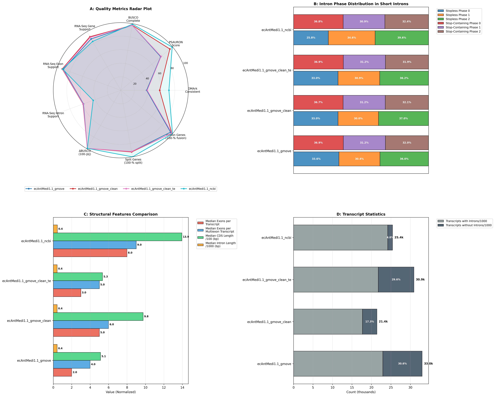

# AnnoAudit - Annotation Auditor

AnnoAudit is a robust Nextflow pipeline designed to evaluate the quality of genomic annotations through a multifaceted approach.

## Table of Contents
- [Overview](#overview-of-the-workflow)
- [Input Data](#input-data)
- [Pipeline Steps](#pipeline-steps)
- [Output Data](#output-data)
- [Prerequisites](#prerequisites)
- [Installation](#installation)
- [Running AnnoAudit](#running-annoaudit)
  - [Before Running (Important)](#before-running-the-pipeline-important)
  - [How to Run](#how-to-run-the-code)
  - [Parameters](#other-parameters-for-running-the-analysis)
- [Example Output](#example-output)
- [Comparing Multiple Runs](#comparing-the-output-from-multiple-runs)
- [Future Work](#future-work)

## Overview of the workflow

The workflow assess the annotation quality based on different criteria:
- Protein evidence support
- RNASeq evidence support
- Statistics of the predictions (i.e., gene length, exon number, etc.)
- Ortholog analysis (BUSCO, OMArk)

### Input data

- Reference genome `genome.[.fna, .fa, .fasta]`
- Annotation output `annotation.gff`
- RNAseq data listed in a metadata csv file. Input type can be mixed between long and short reads, with the option of single-end read. The input file should follow the format below:

```
sample_id,R1_path,R2_path,read_type
SAM1,/path/to/R1,,long             # For long reads
SAM2,/path/to/R1,/path/to/R2,short # For PE reads
SAM3,/path/to/R1,,short            # For SE reads
```

- Protein reference data in `fasta` format for evaluation, if not given, then the `Uniprot-SwissProt` will be downloaded and used.

### Pipeline steps


The main pipeline is divided into five different subworkflows.
- `General statistics`: Calculate the statistics obtained from the GFF file.
- `RNASeq analysis`: Map the RNASeq data to the genome (or with provided mapping bam file) to generate exon, intron, transcript coverage.
- `Ortholog analysis`: Compare the predicted proteome to known database using BUSCO and OMArk (OMA database).
- `Protein analysis`: Blast the predicted proteome to a known database (could be of relative species) to obtain best reciprocal hits (BRH), then generate statistics based on the BRH results.

### Output data

- Output text file contain the statistic calculated from the input `GFF` file: 
  - General statistics
  - BUSCO
  - OMArk
  - PSAURON
  - Best reciprocal hits
  - RNASeq analysis

## Prerequisites

The following programs are required to run the workflow and the listed version were tested. 

`nextflow v23.04.0 or higher`

`singularity`

`docker` (have not been tested but in theory should work fine)

## Installation

Simply get the code from github or workflowhub and directly use it for the analysis with `nextflow`.

```
git clone https://github.com/ERGA-consortium/AnnoAudit
```

## Running AnnoAudit

### Before running the pipeline (IMPORTANT)

One thing with Nextflow is that it is running off a Java Virtual Machine (JVM), and it will try to use all available memory for Nextflow even though it is unnecessary (for workflow management and job control). This will cause much trouble if you run a job on an HPC cluster. Thus, to minimize the effect of it, we need to limit the maximum memory the JVM can use.

```
export NFX_OPTS="-Xms=512m -Xmx=3g"
```

`-Xms` is the lower limit, which is set as 512 MB.
`-Xmx` is the upper limit, which in this case is set as 3 GB.
Please modify this according to your situation.

### How to run the code

```
nextflow run main.nf --genome genome.fasta \
      --gff annotation.gff3 \
      --rnaseq metadata.csv [--genome_bam path/to/the/mapped/bam]\
      --outdir OUTDIR_NAME \
      --taxon_id 9606 [Optional] \
      --ncbi_query_email xxxx \
      --rm -resume
```

### Other parameters for running the analysis

```
Input parameter:
--genome                  Draft genome fasta file contain the assembled contigs/scaffolds.
--gff                     Annotation file that need to be evaluated.
--genome_bam              BAM file contain the mapped information from the RNASeq to the genome FASTA.
--rnaseq                  A metadata CSV file following the pattern: sample_id,R1_path,R2_path,read_type. Required if `genome_bam` is not provided.
--taxon_id                Taxon ID for identifying BUSCO lineage and download protein data from NCBI if needed.
--tolid                   TOLID (or an identifier string for the species).
--ncbi_query_email        Email for querying protein from NCBI database.

Optional input:
--protein                  Fasta file containing translated protein sequences from the GFF for running evaluation. If not specified, the workflow will automatically extract it from the
 `genome` and `gff`.
--ref_protein              Fasta file containing the reference protein sequences to be used for evaluation. Ideally this should come from the same species and/or closely related specie
s. If not provided, the workflow will download the proteome from NCBI or using Uniprot SwissProt database.
--lineage                  Lineage information providing for BUSCO, if not provided, the workflow will automatically search for the closest lineage. Example: eudicots_odb10.
--genetic_code             Genetic code for translation of protein.
--stranding                Strandness of the RNASeq reads used for extraction of junction position using `regtools`.

Database input:
--odb_version              odb version to choose to run BUSCO, option: odb12, odb10. [default: odb12]
--busco_database           Pathway to the BUSCO databse store locally. [default: null]
--oma_database             Pathway to the OMA database, if not specified, the workflow will download it automatically. [default: null]
--ref_protein              Pathway to the reference proteome for comparison. [default: null]
--ncbi_query_count         Number of protein to extract from the NCBI database. [default: 100000]
--ncbi_query_batch         Number of protein to query for each batch. [default: 1000]

Output option:
--pdf                      Output PDF name. [default: AnnoAudit_Report.pdf]
--outdir                   Output directory. [default: /env/export/bigtmp2/pdoan/evaluate_pipeline]
--tracedir                 Pipeline information. [default: /env/export/bigtmp2/pdoan/evaluate_pipeline/pipeline_info]
--publish_dir_mode         Option for nextflow to move data to the output directory. [default: copy]
--tmpdir                   Database directory. [default: /env/export/bigtmp2/pdoan/evaluate_pipeline/tmpdir]

Conditioning options:
--rnaseq_single             If specify, will run `featureCounts` in single read mode, this is necessary if the mapped RNASeq is single-ended. [default: false]
--run_blast                 If specify, will use `blast` for running best reciprocal hits instead of DIAMOND. [default: false]
--query_ncbi_prot           If specify, will download the reference proteome from NCBI, other wise, will use the provided proteom or Uniprot SwissProt. [default: true]
--cds_only                  If specify, only extracting information from the GFF file using the CDS line. [default: "False"]

--help                   Print help message.

Execution/Engine profiles:
The pipeline supports profiles to run via different Executers and Engines e.g.: -profile local,conda

Executer (choose one):
  local
  slurm

Engines (choose one):
  docker
  singularity
  apptainer

Per default: -profile slurm,singularity is executed.
```

## Example output

Below is the sample output of this workflow. The example PDF output is located in `assest` folder.
[Example PDF](assets/AnnoAudit_Report.pdf)

```
|Taxon Info                                               | Value                                   |
-----------------------------------------------------------------------------------------------------
|TxID                                                     | 105859                                  |
|Species                                                  | Antedon mediterranea                    |
|Phylum                                                   | Echinodermata                           |
|Class                                                    | Crinoidea                               |
|Order                                                    | Comatulida                              |
|ToLID                                                    | ecAntMedi1.1_ncbi                       |


|General Statistics                                       | Value                                   |
-----------------------------------------------------------------------------------------------------
|num_genes                                                | 24442                                   |
|mean_gene_length                                         | 10165.06                                |
|median_gene_length                                       | 4233.5                                  |
|num_transcripts                                          | 25416                                   |
|mean_transcripts_per_gene                                | 1.48                                    |
|median_transcripts_per_gene                              | 1.0                                     |
|num_exons                                                | 313568                                  |
|mean_exons_per_transcript                                | 11.55                                   |
|median_exons_per_transcript                              | 8.0                                     |
|mean_exons_per_multiexon_transcript                      | 12.08                                   |
|median_exons_per_multiexon_transcript                    | 9.0                                     |
|num_transcripts_without_introns                          | 1228 (4.83%)                            |
|num_exon_3n                                              | 136217 (43.44%)                         |
|num_exon_3n1                                             | 89437 (28.52%)                          |
|num_exon_3n2                                             | 87914 (28.04%)                          |
|mean_cds_length                                          | 2071.59                                 |
|median_cds_length                                        | 1395.0                                  |
|total_cds_length                                         | 52651413                                |
|percentage_cds_coverage                                  | 14.85%                                  |
|num_introns                                              | 279614                                  |
|mean_intron_length                                       | 1394.05                                 |
|median_intron_length                                     | 447.0                                   |
|mean_introns_per_transcript                              | 10.55                                   |
|median_introns_per_transcript                            | 7.0                                     |
|short_intron_3n/short_intron                             | 6113 (35.58%)                           |
|long_intron_3n/long_intron                               | 86931 (33.13%)                          |
|stopless_short_intron_3n/stopless_short_intron           | 479 (25.77%)                            |
|stopless_short_intron_3n1/stopless_short_intron          | 644 (34.64%)                            |
|stopless_short_intron_3n2/stopless_short_intron          | 736 (39.59%)                            |
|stop_containing_short_intron_3n/short_containing_intron  | 5634 (36.77%)                           |
|stop_containing_short_intron_3n1/short_containing_intron | 4730 (30.87%)                           |
|stop_containing_short_intron_3n2/short_containing_intron | 4960 (32.37%)                           |


|BUSCO                                                    | Value                                   |
-----------------------------------------------------------------------------------------------------
|lineage_dataset                                          | metazoa_odb12                           |
|n_markers                                                | 672                                     |
|BUSCO Assem                                              | C:98.4[S:98.1,D:0.3],F:0.9,M:0.7,E:26.0 |
|BUSCO Annot                                              | C:99.3[S:74.0,D:25.3],F:0.6,M:0.1       |
|Delta BUSCO                                              | 0.9%                                    |


|OMARK                                                    | Value                                   |
-----------------------------------------------------------------------------------------------------
|OMA_clade                                                | Eleutherozoa                            |
|num_conserved_hogs                                       | 8933                                    |
|single                                                   | 5266 (58.95%)                           |
|duplicated                                               | 1867 (20.90%)                           |
|duplicated_unexpected                                    | 1865 (20.88%)                           |
|duplicated_expected                                      | 2 (0.02%)                               |
|missing                                                  | 1800 (20.15%)                           |
|num_proteins_in_proteome                                 | 25416                                   |
|total_consistent                                         | 18127 (71.32%)                          |
|consistent_partial_hits                                  | 4198 (16.52%)                           |
|consistent_fragmented                                    | 667 (2.62%)                             |
|total_inconsistent                                       | 3285 (12.92%)                           |
|inconsistent_partial_hits                                | 1672 (6.58%)                            |
|inconsistent_fragmented                                  | 177 (0.70%)                             |
|total_contaminants                                       | 0 (0.00%)                               |
|contaminants_partial_hits                                | 0 (0.00%)                               |
|contaminants_fragmented                                  | 0 (0.00%)                               |
|total_unknown                                            | 4004 (15.75%)                           |


|PSAURON                                                  | Value                                   |
-----------------------------------------------------------------------------------------------------
|psauron_score                                            | 99.4                                    |
|true_count                                               | 25270                                   |
|false_count                                              | 146                                     |
|median_score                                             | 0.99642                                 |
|max_score                                                | 1.0                                     |
|min_score                                                | 0.00168                                 |


|Best Reciprocal Hits                                     | Value                                   |
-----------------------------------------------------------------------------------------------------
|num_best_reciprocal_hits                                 | 18057                                   |
|num_split_gene_length_<0.75x                             | 11 (0.06%)                              |
|num_fusion_gene_length_>1.25x                            | 0 (0.0%)                                |
|KL_divergence_normalized                                 | 0.0001                                  |
|JS_divergence_normalized                                 | 0.0                                     |
|Wasserstein_distance                                     | 0.255469                                |


|RNASeq                                                   | Value                                   |
-----------------------------------------------------------------------------------------------------
|mapping_rate                                             | 82.6%                                   |
|primary_mapping_rate                                     | 81.52%                                  |
|properly_paired                                          | 76.99%                                  |
|num_gene_supported                                       | 18387 (83.37%)                          |
|num_exon_supported                                       | 287195 (91.59%)                         |
|num_exact_intron_boundary                                | 0 (0.0%)                                |
|num_intron_supported_canonical                           | 0 (0.00%)                               |
|num_intron_supported_non_canonical                       | 0 (0.00%)                               |
```

## Comparing the output from multiple runs

In order to compare the output from multiple runs, either of the same species or from different species, we provide a script in the bin directory for a comprehensive view of the results. Just have to gather all the JSON outputs of AnnoAudit in the same folder, then run the script directly.

```
python bin/compare_audit.py
```

Here is an example output of the script



## Future work

